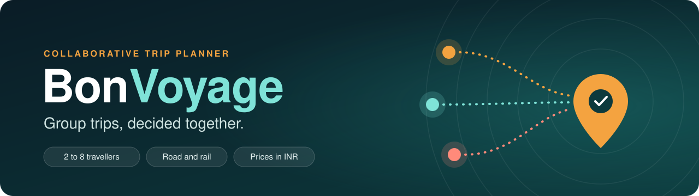
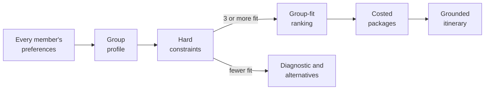
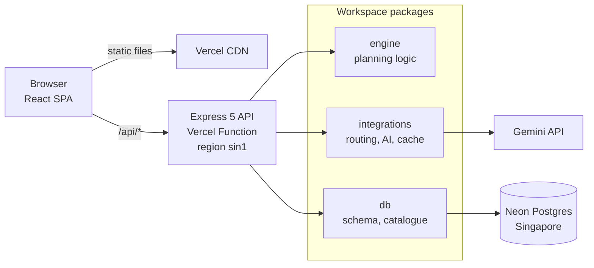
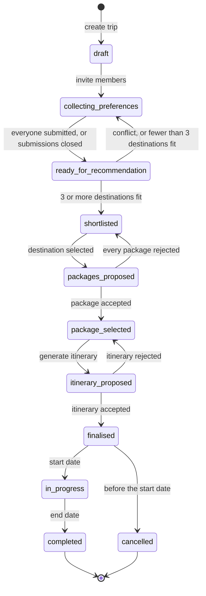

<div align="center">



<p>
  <a href="https://github.com/thenamakop/BonVoyage/actions/workflows/ci.yml"></a>
  
  
  
  
  
  
  
  <a href="https://bonvoyage-orpin.vercel.app/"></a></p>

**[Quick start](#quick-start)** · **[How it decides](#how-it-decides)** · **[Architecture](#architecture)** · **[Roadmap](#roadmap)** · **[Documentation](#documentation)**

</div>

> [!NOTE]
> BonVoyage is a Software Engineering course project at BML Munjal University, under active development. The [roadmap](#roadmap) shows what is built and what is next.

## What is BonVoyage?

Planning a trip with friends is a coordination problem, not a search problem. Everyone wants somewhere different, can spend a different amount and is free on different days, and a group chat rarely settles it.

BonVoyage collects each member's preferences, budget and dates in a structured form. It then removes every destination the group cannot actually do, ranks the rest by how well they suit **the whole group**, and turns the winner into costed trip packages and a day-wise itinerary. It is built for groups of **2 to 8 people** travelling **within India by road or rail**, with every price in **rupees**.

| Feature | What it means for the group |
| --- | --- |
| **Group-first input** | Each member picks destination types, activities, climate, a budget range and the dates they are free. Profiles stay private; the group only sees aggregates. |
| **Constraints before taste** | Distance, trip length, the shared date window, season and budget are checked in plain arithmetic before anything is ranked. |
| **Fair ranking** | A group-fit score favours places most members like and penalises places that split the group. |
| **Honest empty results** | When fewer than three places fit, BonVoyage names the constraint that ruled them out and the nearest alternatives, instead of failing. |
| **Costed packages** | At least three options, each itemised as a group total and per person, with every figure labelled by where it came from. |
| **Grounded itinerary** | Gemini writes the day-wise plan from a fact sheet; a validator checks every place, number and opening hour before anyone sees it. |
| **The group decides** | Accept, modify or reject any package or itinerary. Finished trips stay in each member's history. |

## How it decides



1. **Group profile.** Every member's types, activities, climate, budget and dates are combined into one profile, with the shared date window and any conflicts named.
2. **Hard constraints.** Each destination must be within the radius, fit the trip length, be visitable in the shared window and in season, and fit the budget. Anything that fails is removed before ranking.
3. **Group-fit ranking**, or a diagnostic when fewer than three destinations survive: the constraint that ruled out the most places, and the nearest alternatives if it were relaxed.
4. **Costed packages** for the chosen destination: transport, stay, food and activities, as a group total and per person.
5. **Grounded itinerary.** Gemini writes the day-wise plan from a fact sheet, and a validator checks it. The group then accepts, modifies or rejects it.

Each member's fit with a destination $d$ blends how well its types $T$, activities $A$ and climate $c$ match theirs, using Jaccard similarity $J$:

```math
s_i(d) = 0.5\,J(T_i, T_d) + 0.3\,J(A_i, A_d) + 0.2\,c_i(d)
```

The group-fit score rewards a high average, protects the least happy member and penalises disagreement:

```math
\mathrm{GFS}(d) = \alpha \cdot \operatorname{mean}_i\, s_i(d) + \beta \cdot \min_i\, s_i(d) - \gamma \cdot \operatorname{sd}_i\, s_i(d)
```

By default $\alpha = 0.5$, $\beta = 0.3$ and $\gamma = 0.2$, and the weights are stored with every recommendation run. In the spec's worked example, ranking by average alone puts a destination that only one member likes in second place; the disagreement penalty moves it to third. The full definitions, the five hard constraints and the diagnostic rules are in [`docs/specs/scoring.md`](docs/specs/scoring.md).

### Where the numbers come from

- **Curated catalogue.** About 40 destinations within roughly 800 km of Gurugram, with stay tiers, daily costs, fares and places to visit. Every number carries a source link and the date it was checked.
- **Provenance labels.** Every figure shown to a user is marked `live`, `cached`, `curated` or `estimated`, and every price shows the group total, the per-person amount and an "estimate" label.
- **Distances.** Curated road distances from the starting hub, or a straight-line distance multiplied by 1.3 and labelled `estimated` when no curated figure exists.
- **The model never supplies facts.** Gemini only composes and explains. Prices, distances, durations, opening hours and place names always come from the catalogue or the database.

## Architecture



One Vercel project serves everything. The build writes Vercel's Build Output API directory: the SPA as static files, and the whole API as a single esbuild-bundled function in Singapore, next to the database. The browser talks to one origin, so session cookies stay first-party on every preview.

```text
apps/
  web/            React 19 SPA: Vite, React Router, TanStack Query, Tailwind CSS
  api/            Express 5 API: createApp() in src/app.ts, one folder per SRS module in src/modules/
packages/
  engine/         pure logic: feasibility, group-fit score, trip state machine (no I/O, no clock)
  integrations/   every outbound call: routing, Gemini, catalogue fallback, caching
  db/             Drizzle schema, migrations, seed, curated catalogue CSVs and checks
  shared/         zod schemas and types used by both web and api
docs/             SRS baseline, design diagrams, decisions, specs, sprint prompts and reviews
scripts/          build and maintenance scripts
```

Imports flow one way: apps use packages, packages never import apps, and `engine` imports nothing that does I/O, so the planning logic is tested in isolation.

| Layer | Technology | Decision |
| --- | --- | --- |
| Language | TypeScript 6, strict mode | ADR-001 |
| Monorepo | pnpm 10 workspaces on Node.js 24 LTS | ADR-002 |
| Web | React 19, Vite 8, React Router, TanStack Query 5, Tailwind CSS 4 | ADR-003 |
| API | Express 5 with zod 4 validation and one error envelope | ADR-004 |
| Database | PostgreSQL 18 with Drizzle ORM: Docker locally, Neon when deployed | ADR-005 |
| Travel data | Curated catalogue with provenance on every figure | ADR-006 |
| Distances | `RoutingProvider`: curated hub distances, else haversine × 1.3 | ADR-007 |
| Language model | Gemini behind an `LlmClient` interface, model set by `GEMINI_MODEL` | ADR-008 |
| Auth | Better Auth: email and password, sessions in Postgres | ADR-009 |
| Hosting | Vercel (Build Output API, region sin1) and Neon (Singapore) | ADR-010 |
| Tests | Vitest 5, Testing Library, Supertest | |

The reasoning behind each choice is in [`docs/decisions/`](docs/decisions).

<details>
<summary><b>Trip lifecycle</b>: every trip moves through one state machine</summary>

<br>



A trip can be cancelled from any planning state, and from `finalised` until the start date. The API rejects any other move with HTTP 409, and every change is recorded in an audit table. The full transition table is in [`docs/RUNBOOK.md`](docs/RUNBOOK.md) (Appendix B2), with clarifications in [decision 0001](docs/decisions/0001-state-machine-clarifications.md).

</details>

## Quick start

**You need** Node.js 24 LTS, pnpm 10, Docker Desktop and Git. On Windows, every script works in both PowerShell and Git Bash.

```bash
git clone https://github.com/thenamakop/BonVoyage.git
cd BonVoyage
cp .env.example .env     # then fill in the three empty secrets (table below)
pnpm install
pnpm db:up               # Postgres 18: development on :5432, tests on :5433
pnpm db:migrate
pnpm db:seed             # catalogue, four demo users and a demo trip
pnpm dev                 # web on :5173, API on :4000
```

Open <http://localhost:5173>. The home page should read **API ok · Database ok**, and the API answers through the Vite proxy:

```bash
curl http://localhost:5173/api/health
# {"status":"ok","db":"ok"}
```

### Environment variables

`.env.example` lists every variable. Locally you only fill in the three secrets.

| Variable | Used for | Local value |
| --- | --- | --- |
| `DATABASE_URL` | API and database scripts | Docker URL, already in `.env.example` |
| `TEST_DATABASE_URL` | integration tests (they wipe this database) | Docker URL on port 5433, already set |
| `BETTER_AUTH_SECRET` | signing sessions | **secret**: 32 random bytes, command below |
| `GEMINI_API_KEY` | itinerary generation | **secret**: a Google AI Studio key |
| `SEED_DEMO_PASSWORD` | demo accounts from `pnpm db:seed` | **secret**: any 12+ characters |
| `GEMINI_MODEL` | which Gemini model to call | `gemini-3.8-flash` |
| `LIVE_APIS` | `off` answers from fixtures and curated data, spending no quota | `off` |
| `APP_URL`, `PORT`, `LOG_LEVEL` | URLs, API port, log detail | `http://localhost:5173`, `4000`, `info` |

```bash
node -e "console.log(require('node:crypto').randomBytes(32).toString('base64url'))"
```

> [!IMPORTANT]
> `.env` and `.env.neon` are git-ignored. Never commit them, and never paste a key into an issue, a pull request or a chat.

<details>
<summary><b>Windows notes</b></summary>

<br>

- **Use Node 24, not the newest Node.** The repo pins Node 24 and pnpm refuses other majors. With [fnm](https://github.com/Schniz/fnm), add this line to your PowerShell profile (`notepad $PROFILE`) so the right version loads inside the repo:
  ```powershell
  fnm env --use-on-cd --shell powershell | Out-String | Invoke-Expression
  ```
- **Ports.** Development uses 5173 (web), 4000 (API), 5432 and 5433 (Postgres). If another project's Postgres holds a port, stop it first. To find the process, run `netstat -ano | findstr :5433`.
- **Line endings.** The repo stores LF; `.gitattributes` handles the conversion.

</details>

## Scripts

All scripts run from the repository root.

| Area | Command | What it does |
| --- | --- | --- |
| Develop | `pnpm dev` | Web and API together, with hot reload |
| | `pnpm build` | Production build of web and API |
| Quality | `pnpm verify` | Format check, lint, type-check, all tests and the build. Run it before every pull request. |
| | `pnpm lint` | ESLint with type-aware rules |
| | `pnpm typecheck` | TypeScript across every package |
| | `pnpm test` | All three test projects |
| | `pnpm test:unit` | Only the tests that need no database |
| | `pnpm format` | Format with Prettier |
| Database | `pnpm db:up` | Start the local Postgres containers (`db:down` stops them) |
| | `pnpm db:generate` | Create a migration from schema changes |
| | `pnpm db:migrate` | Apply migrations to the local database |
| | `pnpm db:seed` | Load the catalogue, demo users and a demo trip |
| | `pnpm db:reset` | Rebuild the local database from scratch |
| | `pnpm db:studio` | Browse the database in Drizzle Studio |
| | `pnpm db:migrate:remote` | Migrate a Neon branch from your laptop with `--target preview` or `--target production` (asks for confirmation) |
| Catalogue | `pnpm catalogue:check` | Validate the catalogue CSVs and report verification progress |
| | `pnpm catalogue:import` | Load the catalogue into a database (`--target local`, `preview` or `production`) |
| Deploy | `pnpm vercel-build` | Build the `.vercel/output` directory that Vercel deploys |
| | `pnpm smoke:function` | Smoke-test the exact function bundle that CI ships |

## Testing

Tests use [Vitest](https://vitest.dev) with three projects:

| Project | What it covers | Needs Docker |
| --- | --- | --- |
| `unit` | Package logic: the engine, schemas, integrations and catalogue checks | No |
| `web` | React screens in jsdom with Testing Library | No |
| `integration` | API routes with Supertest, and the database layer, against the test Postgres on port 5433 | Yes |

Tests always run with `LIVE_APIS=off`, so they spend no API quota and need no keys, and they never touch Neon. Every change ships with its tests in the same pull request.

## Deployment

| Event | Vercel | Database |
| --- | --- | --- |
| Pull request opened or updated | Preview deployment, behind Vercel login | Neon branch `preview` |
| Merge to `master` | Production deployment | Neon default branch |

CI runs on every pull request: format check, lint, type-check, tests against a Postgres service, the Vercel build and a smoke test of the bundled function. `master` only accepts squash-merged pull requests that pass it. Migrations reach Neon only through `pnpm db:migrate:remote`, run from a laptop with the direct connection strings in `.env.neon`, never from CI or a Vercel build.

## Roadmap

| Sprint | Dates (2026) | Goal | Requirements | Status |
| --- | --- | --- | --- | --- |
| S0 | 8&nbsp;to&nbsp;11&nbsp;Oct | Foundations: decisions, scaffold, CI and deploy, catalogue, schema and auth, state machine, Gemini spike | R11 | In progress |
| S1 | 12&nbsp;to&nbsp;18&nbsp;Oct | Accounts, trips, invitation links, preference form, dashboard, privacy rules | R1, R2, R3, R9, R10 | Planned |
| S2 | 19&nbsp;to&nbsp;25&nbsp;Oct | Group profile, feasibility filter, group-fit ranking with reasons, diagnostic | R4 to R7, R16 | Planned · gate G1: group flow works |
| S3 | 26&nbsp;Oct&nbsp;to 1&nbsp;Nov | Transport comparison, costed packages, provenance, package decisions | R8, R14 | Planned · gate G2: MVP accepted |
| S4 | 2&nbsp;to&nbsp;7&nbsp;Nov | Grounded itinerary, accept, modify or reject, trip history | R12, R13 | Planned |
| Buffer | 8&nbsp;to&nbsp;10&nbsp;Nov | Feature freeze, response-time checks, demo data, report | R15 | Submission on 10 Nov |

The requirements follow the project's MoSCoW prioritisation: **R1 to R11** are Must have, **R12 to R16** Should have, **R17** (fairness across rounds) and **R18** (voting) are Could have and deferred past submission, and **R19** (payments and booking) and **R20** (nationwide live inventory) are out of scope. [`docs/traceability.md`](docs/traceability.md) links each requirement to its SRS section, issues and tests.

## Documentation

| Where | What |
| --- | --- |
| [`AGENTS.md`](AGENTS.md) | Rules for anyone changing the code, including AI coding agents: design rules, conventions, definition of done |
| [`CONTRIBUTING.md`](CONTRIBUTING.md) | Working agreement: branches, commits, pull requests |
| [`docs/baseline/`](docs/baseline) | Approved SRS v1.1, MoSCoW prioritisation and synopsis |
| [`docs/design/`](docs/design) | Data flow diagrams, sequence diagram and state machine |
| [`docs/decisions/`](docs/decisions) | Architecture decision records ADR-001 to ADR-010 and later decisions |
| [`docs/specs/scoring.md`](docs/specs/scoring.md) | Feasibility rules, the group-fit score and a worked example |
| [`docs/traceability.md`](docs/traceability.md) | Requirements mapped to SRS sections, issues and tests |
| [`docs/prompts/`](docs/prompts) | The agent prompts each sprint was built from |
| [`docs/sprints/`](docs/sprints) | Sprint reviews |
| [`docs/RUNBOOK.md`](docs/RUNBOOK.md) | The original pre-development plan |

## Contributing

1. Branch from `master`: `feat/<issue>-<slug>`, `fix/<issue>-<slug>`, `chore/<slug>` or `docs/<slug>`.
2. Write [Conventional Commits](https://www.conventionalcommits.org) (`feat:`, `fix:`, `docs:`, `test:`, `chore:`, `refactor:`). The pull request title becomes the squash commit, so give it the same form.
3. Keep each pull request to one concern and roughly 400 changed lines, with its tests. Add screenshots at 360 px and desktop widths for UI changes.
4. Run `pnpm verify` and paste the output into the pull request.

Read [`AGENTS.md`](AGENTS.md) before your first change. It lists the eight design rules that a passing test suite does not excuse breaking.

## Team

| Member | Role | Owns (course plan) |
| --- | --- | --- |
| **Maulik** ([@thenamakop](https://github.com/thenamakop)) | Tech lead and developer | Architecture, filtering and recommendation engine, implementation |
| **Kushagra** | Frontend lead | Screens for every module, 360 px layouts, accessibility |
| **Manan** | Data and integrations lead | Destination catalogue, transport and cost, packages, external data |
| **Parth** | AI and quality lead | Itinerary generator and validator, notifications, trip feedback, test plan |

Users and groups, and preferences, are shared between Maulik and Parth. The code is written by Maulik with AI coding agents, following [`AGENTS.md`](AGENTS.md).

## Good to know

- **Planning, not booking.** BonVoyage does not take payments, hold inventory or make reservations. Every price is an estimate or a dated quotation, and bookings happen outside the app.
- **Privacy.** A member's preferences are visible only to them; the rest of the group sees aggregates. Prompts sent to Gemini contain destination facts only, never names, emails or personal budgets, because free-tier prompts may be used to improve Google's products.
- **AI output is checked, not trusted.** An itinerary item that cannot be verified against the catalogue is marked unverified or dropped.

## License

No license has been chosen yet. Until a `LICENSE` file is added, all rights are reserved by the authors.

<div align="center">
<br>
<sub>Built at BML Munjal University · Software Engineering · 2026</sub>
</div>
